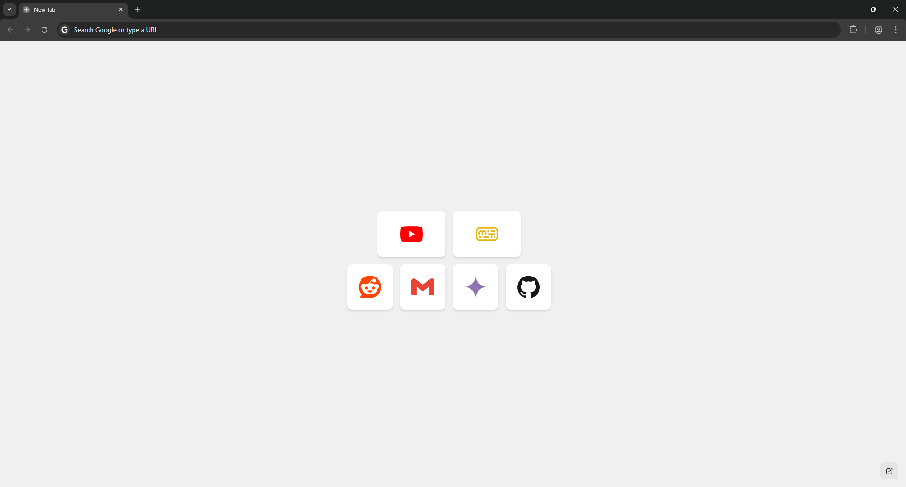
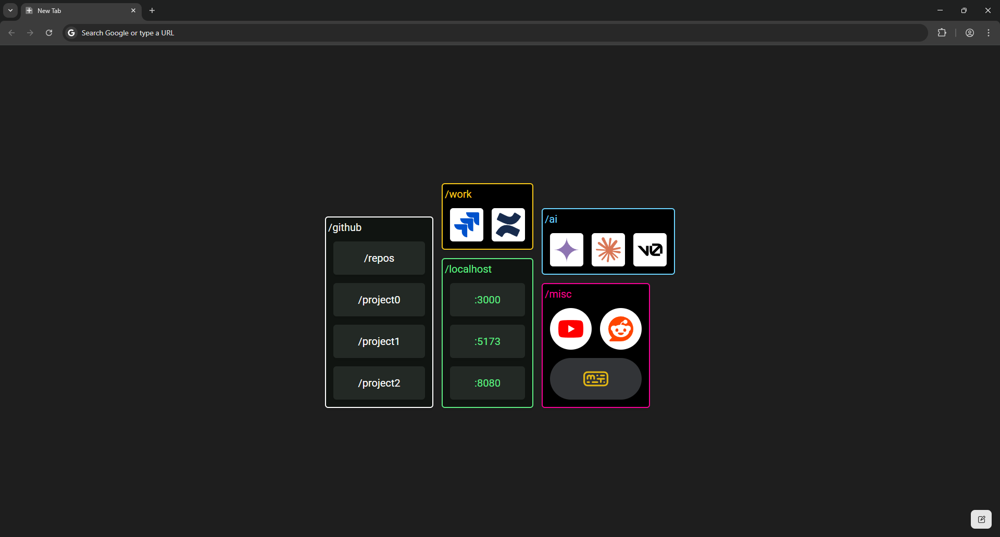

# CanvasNewTab

CanvasNewTab is a browser extension that replaces deafult home page with new tab that you can design yourself.

Screenies:





See sample configurations in ./sample directory.

# Development

```sh
pnpm install
pnpm dev
```

WXT will open a new clean instance of Chrome browser automatically. Here, open a new tab. Prompt will appear notifying you that "This page was changed by "CanvasNewTab" extension". Click "Keep it". Then remove footer by clicking "Cutomize Chrome" -> Footer -> Show footer on New Tab page -> OFF

# Techs

- React
- WXT
- shadcn
- TailwindCSS
- DndKit

# Features

- Replaces browser's default home page
- Canvas with items and groups
- Enter text or SVG icon
- Select and edit multiple items at once

# Credits

Icons (SVG) for sample themes were taken from https://simpleicons.org/
